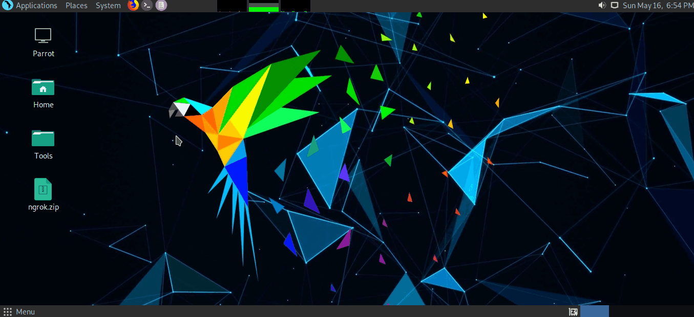

# Get A Device Location & Details Accurately 

## Objective
1. Getting target device details
2. Location of target device 

## Required Tools / Packages
1. A tunnel service. We'll use [**ngrok**](https://ngrok.com/)
2. [seeker](https://github.com/thewhiteh4t/seeker)
3. python / python3

## Install
### ngrok
* Create an account in [ngrok](https://ngrok.com). You'll see the following dashboard.<br /><br />
<br /><br />
* Then download ngrok file. Unzip it with following command
```
    unzip ngrok.zip
```

* Now **ngrok ready to use**, but we'll add authtoken since it'll grant us access to more features and longer session times.

* Now go to the folder you downloaded and open a terminal and execute the following command
```
./ngrok authtoken your_authtoken
``` 
For example:<br />
**./ngrok** **authtoken** 1sbOfjsOGnDmexamplewk87B_4ndexampleKjxyzP6J


### seeker
* Clone the [seeker repository](https://github.com/thewhiteh4t/seeker) on linux.
```
git clone https://github.com/thewhiteh4t/seeker.git
```
* Execute following cmd where you cloned seeker
```
cd seeker/
apt update
apt install python3 python3-pip php
pip3 install requests
```

## Implement

<a href="http://www.youtube.com/watch?feature=player_embedded&v=Bs2y2LjOkqo" target="_blank"></a>

* Note : **Seeker** give us several template. So don't forget to check them.